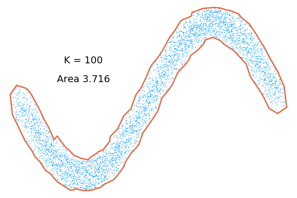

# ConcaveHull

[](https://travis-ci.org/lstagner/ConcaveHull.jl)

This package computes the concave/convex hull of a set of points using a nearest neighbours algorithm[1].

>[1] Moreira, Adriano, and Maribel Yasmina Santos. "Concave hull: A k-nearest neighbours approach for the computation of the region occupied by a set of points." (2007).

## Usage

```julia
Pkg.add("ConcaveHull") # Add package
using ConcaveHull
using Plots

points = [[th, -sin(th)] .+ (0.4*rand(2) .- 0.2) for th in range(0, stop=2pi, length=5000)];
x = [p[1] for p in points];
y = [p[2] for p in points];

hull = concave_hull(points)
hull_area = area(hull)

scatter(x,y,ms=1,label="",axis=false,grid=false,markerstrokewidth=0.0)
plot!(hull)
annotate!(pi/2,0.5,"K = $(hull.k)")
annotate!(pi/2,0.25,"Area $(round(hull_area, digits=3))")
```


## Smoothness
The smoothness of the concave hull can be adjusted by increasing the number of neighbours used
```julia
hull = concave_hull(points,100) # Use 100 neighbours
hull_area = area(hull)

scatter(x,y,ms=1,label="",axis=false,grid=false,markerstrokewidth=0.0)
plot!(hull)
annotate!(pi/2,0.5,"K = $(hull.k)")
annotate!(pi/2,0.25,"Area $(round(hull_area, digits=3))")
```

